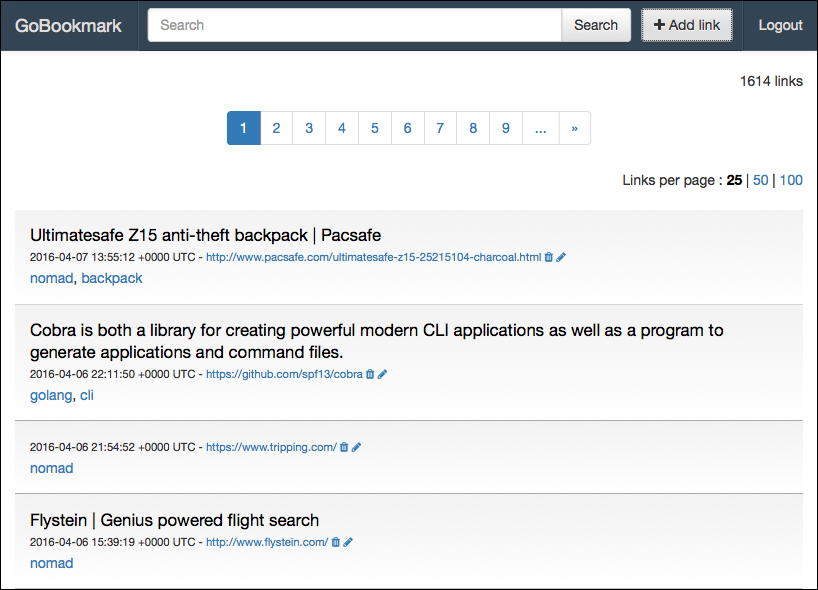
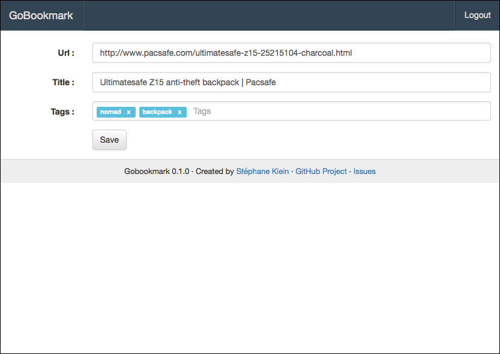

# Gobookmark

[](https://gitter.im/harobed/gobookmark?utm_source=badge&utm_medium=badge&utm_campaign=pr-badge&utm_content=badge)

Inspired by [Shaarli](https://github.com/sebsauvage/Shaarli) (Delicious clone), easier to install (only one standalone executable).

Built with Go - GoBookmark runs without installation on multiple platforms.

[](https://hub.docker.com/r/harobed/gobookmark/)
[](https://gitter.im/harobed/gobookmark)


## Overview

GoBookmark is a personnal web bookmark web service with :

* tags support
* plain text search engine
* no dependencies, only based on filesystem (SQLite + [Bleve](http://www.blevesearch.com/))

## Getting started

1. [Download the latest release](https://github.com/harobed/gobookmark/releases/) of GoBookmark for your platform
2. Configure GoBookmark, or use the default settings

```
$ ./gobookmark web
[negroni] listening on localhost:8000
```

Default password is ```password```.

More info :

```
$ bin/gobookmark --help
NAME:
   gobookmark - A personnal bookmark service

USAGE:
   gobookmark [global options] command [command options] [arguments...]

VERSION:
   0.1.0

COMMANDS:
   web		Start Gobookmark web server
   import	Import bookmark HTML file
   reindex	Execute plain text search indexation
   help, h	Shows a list of commands or help for specific command

GLOBAL OPTIONS:
   --data, -d "gobookmark"	Database filename [$GOBOOKMARK_DATABASE]
   --help, -h			show help
   --version, -v		print the version
```


## Screenshots

***



***



***

## Contributions

### Build

On OSX :

    $ brew install go
    $ go --version
    go version go1.6 darwin/amd64

Download source :

    $ git clone git@gitlab.stephane-klein.info:stephane-klein/gobookmark.git

Build and execute :

    $ cd gobookmark
    $ make install
    $ make serve
    [negroni] listening on :8080


### Test

    $ make test


### Build Docker image

    $ docker build -t gobookmark .

Next push image :

    $ docker tag gobookmark:latest harobed/gobookmark
    $ docker push harobed/gobookmark


## Why I did this project ?

It's my second Golang project, my first Golang web application, it's also a training project.

What I've learned in this project :

* how to use [go-bindata](https://github.com/jteeuwen/go-bindata) to include all assets in a standalone binary
* how to use [migrate](https://github.com/mattes/migrate/), a database migration tool, it's very simple to apply, very KISS
* how to use [bleve](github.com/blevesearch/bleve), a modern text indexing library, it's less powerful than [ElasticSearch](https://github.com/elastic/elasticsearch) but 
  Bleve is embeded in *gobookmark* standalone executable
* how to use [glide](https://github.com/Masterminds/glide) to handle dependencies (after played with [govendor](https://github.com/kardianos/govendor), [godeps](https://github.com/tools/godep)…)
* how to use the [httptreemux](https://github.com/dimfeld/httptreemux) High-speed, flexible tree-based HTTP router
* how to use [gorilla/context](https://github.com/gorilla/context) a golang registry for global request variables
* how to use default golang template engine and database api
